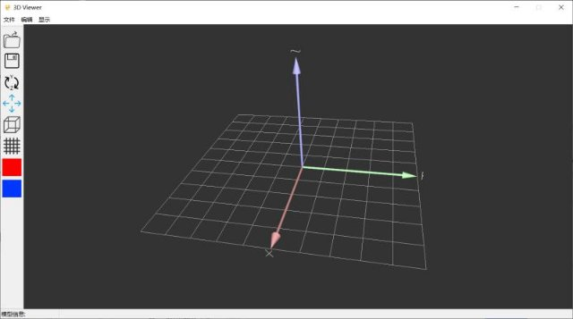
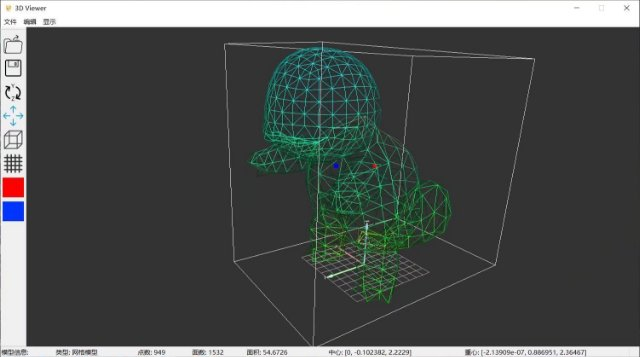
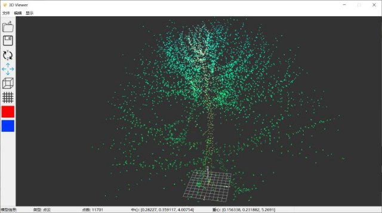

# 3D点云/模型可视化软件

三维数据管理与可视化系统，设计一个易于理解的界面，可以通过菜单、对话框等方式读入三维点云或三维网格模型。
**1) 项目设计思想：**

编写了类(Model.h)。在此为基类编写了分别用于处理三维网格模型和三维点云的类(Pcd.h,Mesh.h)。编写了对数据进行进一步加工处理的(pos3.h)，使用libQglviewer实现了三维显示系统(viewer.h)，并用QT自带的UI设计系统实现了用户界面的可视化(mainwindow.ui)。最终将这些内容耦合以实现三维数据的管理与可视化。

**2) 项目指标及实现方式：**

1. 通过菜单、对话框等方式读入三维点云或三维网格模型。

   使用了Qt自带的UI设计系统(mainwindows.ui)

2. 统计点云的个数、几何重心、AABB包围盒、面片个数、表面积

   编写了用于统计这些内容的类：mesh.h,pcd.h和这两者的基类model.h

3. 以X/Y/Z坐标排序对模型进行颜色条伪彩色显示三维模型

   使用了Qglviewer解决了这一问题

4. 设计点云和三维模型共同的抽象基类Model，点云类PointCloud和三维网格模型Mesh继承自该抽象基类。

   编写了Model和Mesh，详见项目源码。

5. 每种具体的图形（点云/网格等）具有静态变量，以统计该模型在系统中的总数目。

   在项目中的静态变量分别为m1,m2。

6. 每种图形都有点个数成员；并且都有移动函数、计算重心函数等。

   在项目中的函数为long pointnum, Translate(),void cal\_mcenter等。

7. 鼠标拖拽移动/旋转/缩放。

   使用了Qglviewer解决了这一问题。

8. 保存图形到文件，加载图形。

   编写的Mesh和Pcd分别实现了对模型和点云数据的读入，保存和加载。并编写了两者的基类Model。